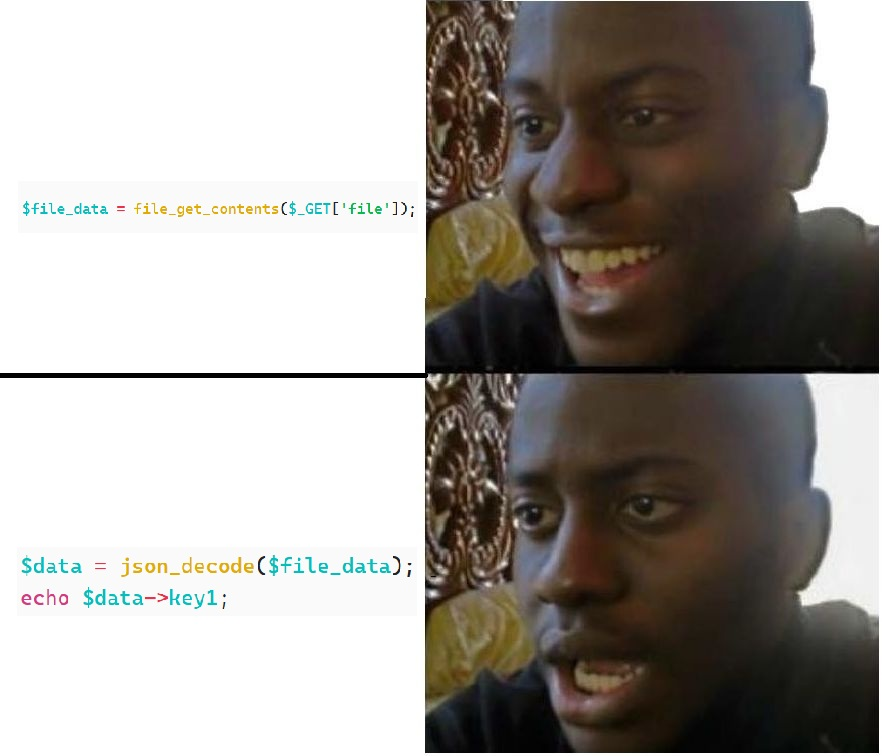
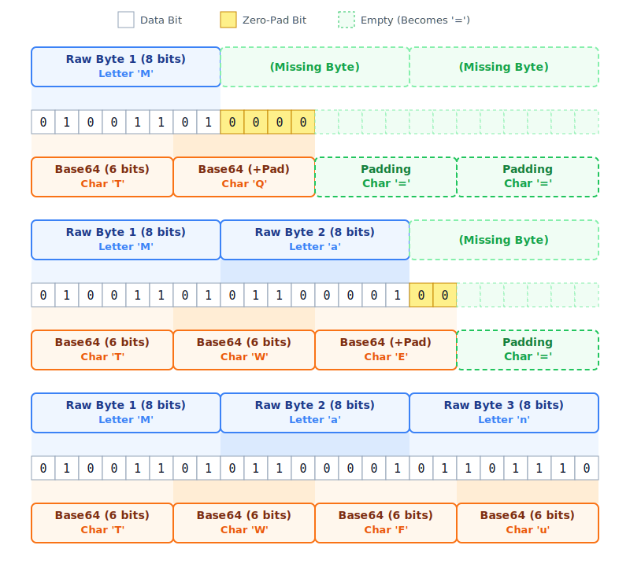
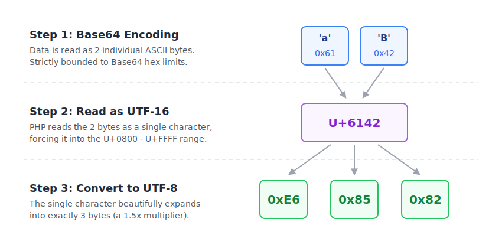
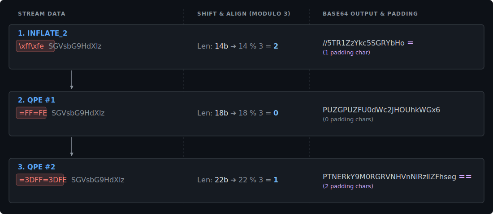
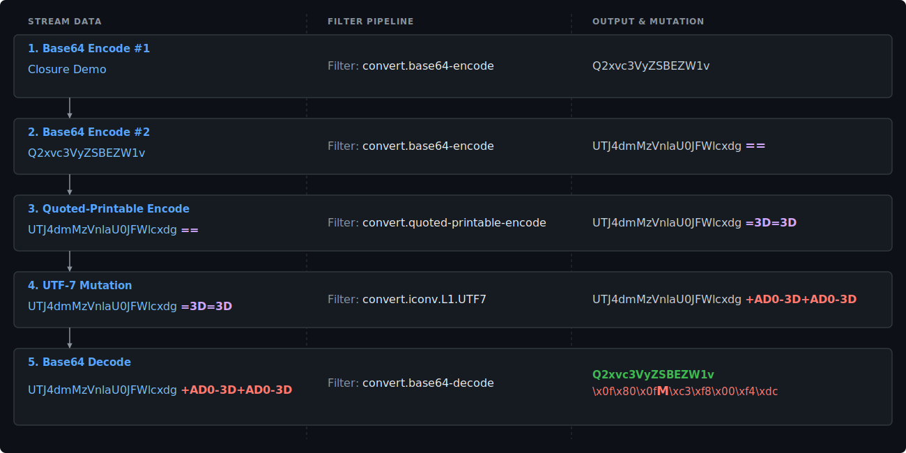
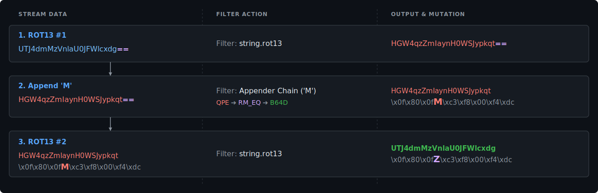
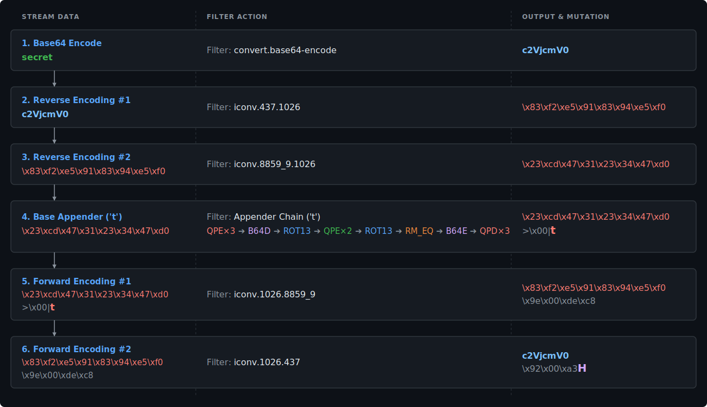
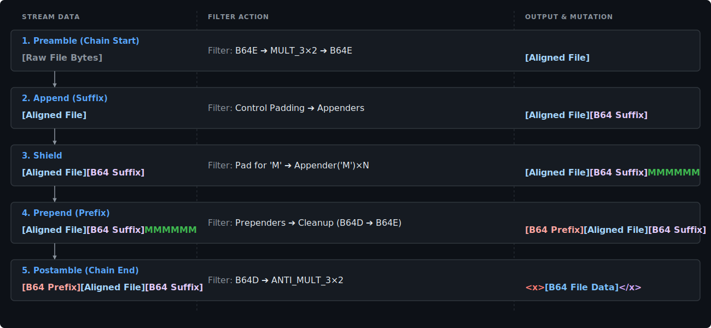



# 1. Abstract
**closure** is a new tool that leverages PHP Filter Chains to encapsulate arbitrary file contents within a chosen **prefix AND suffix**.

- **The Use Case:** Bypassing strict format validations (like `json_decode()` or XML parsing) when exploiting *File Read* vulnerabilities.
- **The Breakthrough:** Unlike the existing tool [wrapwrap](https://github.com/ambionics/wrapwrap), **closure** is entirely **file-size agnostic**.
- **The Impact:** Complete decoupling of chain length from file size. You can read files of any magnitude using a single, static-sized payload.

---
# 2. Introduction

## 2.1. The Problem


In my opinion, aside from actual Remote Code Execution (RCE), an Arbitrary File Read is the most powerful vulnerability you can uncover in a web application. It is the golden ticket that instantly transforms a black-box target into a white-box playground. Source code, environment variables, credentials - everything becomes accessible, drastically expanding your attack surface and paving the way for further escalation.

But the joy of discovering a File Read can quickly turn into frustration when you hit a very specific, yet surprisingly common, roadblock: **format constraints**.

Often, a vulnerability isn't as simple as: 
```php
echo file_get_contents($file);
```
Instead, the application reads the file into memory and attempts to parse it before returning the output. What happens if the code passes the extracted data through functions like `json_decode()` or `DOMDocument::loadXML()`?

The application expects the file to be structured JSON or XML. If you try to read `/etc/passwd` or `wp-config.php`, the parser will instantly choke on the syntax, throw an error, and stop the execution. You successfully read the file into memory, but because it didn't match the required format, you get absolutely nothing back.

To illustrate this, let’s look at a real-world scenario I encountered. I was dealing with a piece of PHP code designed to fetch, process, and display SVG images:
```php
<?php
// display_svg.php

$url = $_GET['url'] ?? '';

if ($url === '') {
    http_response_code(400);
    die('Missing url parameter');
}

// The Vulnerability
$svgData = file_get_contents($url);

$dom = new DOMDocument();

// The Format Restriction
if (!$dom->loadXML($svgData)) {
    http_response_code(400);
    die('Invalid SVG');
}

$svg = $dom->documentElement;

if ($svg && $svg->tagName === 'svg') {
    $svg->setAttribute('style', 'background: black');
}

header('Content-Type: image/svg+xml');
echo $dom->saveXML();
```
Looking at this code, we can try to read any file using the `url` GET parameter, but the server then tries to parse it as an XML document. If unsuccessful, it discards the request and won't return the file data back to us.

So, does this mean we can only read existing XML files? Well, if we can force any arbitrary file on the server to look like a valid XML file, we can read it.
For example, wrapping the file contents with `<x>`, `</x>` should be good enough to pass this check.

But how could we do it, you may ask...

**PHP Filter Chains** !!

## 2.2. Previous Tools

There is some incredibly clever research and tooling surrounding PHP filter chains. For example, **Ambionics' [lightyear](https://github.com/ambionics/lightyear)** is an awesome tool that allows you to exfiltrate arbitrary file contents under blind LFI conditions!

But for the specific problem I needed to solve, these two tools were my starting point:

- **Synacktiv's [php_filter_chain_generator](https://github.com/synacktiv/php_filter_chain_generator):** This was the first tool to automate PHP filter chain generation. Rather than modifying existing files, it generates arbitrary content directly in memory. This allows escalating standard LFI into full RCE without ever needing to upload a file to the server.

- **Ambionics' [wrapwrap](https://github.com/ambionics/wrapwrap):** Building on Synacktiv’s work, Ambionics discovered a clever way to add arbitrary **prefixes** and **suffixes** to existing files, making it possible to bypass most format restrictions and extract arbitrary file contents.

So **wrapwrap** sounds like the exact solution to my situation right? so what's the problem?

Although wrapwrap is a great tool, it has its limitations.
Because of how wrapwrap appends the suffix, the length of the generated filter chain scales directly with the target file's size. The more bytes you want to read, the larger your payload becomes.

This happens because the way wrapwrap adds a suffix to your file is by adding it as a prefix and using **Big Endian - Little Endian** conversions to slide it further into the file contents.
The further you slide the suffix, the more bytes you get out of the file, but also - the larger the payload size gets!

> This is of course over simplified, for the full technical details it's best to read [wrapwrap's research article](https://blog.lexfo.fr/wrapwrap-php-filters-suffix.html), but this is everything you need to know for the sake of this article.

Since web servers strictly limit URL lengths, this scaling becomes a critical issue.
My target server capped URLs at 150KB. Due to wrapwrap's scaling ratio, that massive 150KB payload allowance only let me read about 200 bytes of the file!

Just for perspective this is what you get when reading 200 bytes from a `wp-config.php` file:
```php
<?php
/**
 * The base configuration for WordPress
 *
 * The wp-config.php creation script uses this file during the installation.
 * You don't have to use the website, you can copy this file to "wp-co
```

And this is what you can get from `/etc/passwd`:
```
root:x:0:0:root:/root:/bin/bash
daemon:x:1:1:daemon:/usr/sbin:/usr/sbin/nologin
bin:x:2:2:bin:/bin:/usr/sbin/nologin
sys:x:3:3:sys:/dev:/usr/sbin/nologin
sync:x:4:65534:sync:/bin:/bin/sync
games:x:5:6
```

This made my file read vulnerability pretty useless.
So I had to look for a better way...

---
# 3. Technical Background

## 3.1. PHP Filter Chains

By default, PHP functions like `file_get_contents()` or `fopen()` read local files by simply taking a standard file path.
 However, PHP optionally allows developers to use **wrappers** to change how these functions access data. For example, using the `http://` wrapper fetches a remote web page, while the `zip://` wrapper can read a file nested inside an archive.

Among these built-in options is the `php://` scheme, which provides access to various internal I/O features. The specific component relevant to this technique is the `php://filter` meta-wrapper.

Instead of just reading a file directly, `php://filter` intercepts the file's data stream and allows you to pass it through a series of transformations **before** the application receives the data. 

The syntax allows you to chain as many filters as needed sequentially. The data passes through each filter one by one:
```
php://filter/<FILTER_1>/<FILTER_2>/.../resource=<TARGET_FILE>
```

PHP provides a specific set of available default filters, divided into four main categories:

- **String Filters:** Basic text manipulations like `string.rot13`, `string.toupper`, `string.tolower`, and the deprecated `string.strip_tags`.
- **Conversion Filters:** This category includes `convert.base64-encode` / `convert.base64-decode`, `convert.quoted-printable-encode` / `convert.quoted-printable-decode`, and the highly versatile `convert.iconv.*` filters, which translate data between different character encodings.
- **Compression Filters:** Used to compress or extract streams on the fly (`zlib.deflate` / `zlib.inflate`, `bzip2.compress` / `bzip2.decompress`).
- **Encryption Filters (Deprecated):** The old `mcrypt.*` and `mdecrypt.*` modules.

Individually, these filters were designed for standard tasks, like encoding an image to Base64 or fixing character set issues. However, when chained together in a highly specific order, they can be used to manipulate data in complex, unintended ways.

This concept is known as a **PHP Filter Chain**. By routing the target file through a carefully calculated sequence of these default filters, **closure** eventually constructs arbitrary prefixes and suffixes entirely in memory.
## 3.2. Base64 encoding

The backbone of **closure** is Base64.
To understand how **closure** uses it, we first need to refresh how it works.

Base64 utilizes an alphabet of 64 characters (and one padding character: `=`), meaning each character represents exactly **6 bits** of data. Standard bytes, however, are **8 bits**.

Because of this mismatch, one Base64 character cannot cleanly represent one raw byte. If we use two Base64 characters (12 bits) to represent one byte (8 bits), we are left with 4 unused bits. The only time the bits align perfectly without any waste is when we encode **3 raw bytes (24 bits)** into **4 Base64 characters (24 bits)**.

This alignment is summed up in this diagram:



## 3.3. Prependers

> **Disclaimer**
> This section will not cover the foundational research behind prepending using PHP filter chains from scratch. I will only summarize the parts relevant to this tool. For a deep dive into the core mechanics, you can read [Synacktiv's excellent research article](https://www.synacktiv.com/publications/php-filters-chain-what-is-it-and-how-to-use-it).

Prepending a character using filter chains requires following these 3 steps:

1. **Prepending Conversion** - use an `iconv` conversion that adds known constant bytes to the start of the data

2. **Mutation Chain** - use a filter chain that converts your prepended bytes from the last step to a byte you want to prepend, while keeping the other data mostly the same.

3. **Cleanup** - remove any garbage that is left over from the last 2 steps.

We will dive in into each step, but before we begin we first need to **Base64 encode** our file.

Why? Because generating any raw byte (`\x00` -` \xff`) via filter chains is incredibly difficult. However, if we Base64 encode the file first, our requirement shrinks: we only need to figure out how to prepend the 64 characters used in Base64 (`a-z`, `A-Z`, `0-9`, `+/`). Once we successfully prepend our desired Base64 characters, we simply Base64 decode the entire payload at the end to retrieve our arbitrary raw bytes.

Encoding the file with Base64 will also later allow us to **cleanup** and find **resilient prependers**, as will be explained shortly.

### 3.3.1. Prepending Conversion

A **Prepending Conversion** relies on specific `iconv` PHP filters that naturally add known data to the beginning of a file during character encoding conversion.

The reason certain conversions prepend data usually falls into one of two categories:

- **Stateful Encodings (Escape Sequences):** Some encodings add an escape sequence to signal a switch in the character set.
    
    - For example: `convert.iconv.UTF8.CSISO2022KR` prepends `\x1b$)C`.
    
- **Multibyte Encodings (Byte Order Marks):** Some encodings prepend a BOM to indicate endianness.
    
    - For example: `convert.iconv.L1.UTF16` prepends `\xff\xfe`.
    

### 3.3.2. Mutation Chain

Once we have prepended these initial bytes (like a BOM), we need to mutate them into our target Base64 character.
We do this by passing the data through a chain of `iconv` conversions.
Fortunately we don't need to find these magic chains, they were already brute-forced for us.

This is what allows us to take a highly limited set of prepending conversions and twist them into any Base64 character we need.

For example, let's say we want to prepend the character `c`:  
First, we use `convert.iconv.L4.UTF32` (our Prepending Conversion) to prepend the BOM `\xff\xfe`:


Then, we pass that result through `convert.iconv.CP1250.UCS-2`, our **Mutation Chain**. This mutates the BOM into <code>\xd9\x02<span style="color:red">c</span>\x01</code>. Notice that the character `c` is now safely sitting inside the prepended data!


In this specific example, the **Mutation Chain** only required one filter, but of course chains can be as long as necessary to mutate the bytes into the exact target character.

### 3.3.3. Cleanup

You might have noticed a problem in the previous example: we successfully prepended the character `c`, but we also prepended several garbage bytes (`\xd9`, `\x02`, `\x01`).
We've also apparently spread the Coronavirus again because every original letter now keeps a distance of about 2 meters of `\x00` bytes from its neighbors...
So what do we do now?

Fortunately, PHP's `convert.base64-decode` filter is incredibly forgiving. When it decodes data, **it completely ignores any character that is not part of the standard Base64 alphabet.**

This means that after generating our prepended character alongside the garbage bytes, we can simply run the payload through `convert.base64-decode` followed immediately by `convert.base64-encode`, to drop the invalid garbage bytes, leaving only our valid Base64 character:

* Before:
	

* After:
	


**There's always a catch...**
There is one caveat. Because Base64 operates in strict chunks of 4 characters (as discussed in section 3.2), the decode/encode cleanup process can sometimes truncate a valid character from the end of our data if there is no padding at the end.

To solve this problem, we can intentionally add our own "sacrificial" garbage bytes to the very end of the content. When the cleanup phase chops off trailing characters, it will only destroy our sacrificial bytes, fully protecting the actual file data.

---
# 4. Closure


At its core, **closure** is designed to append a **prefix** and a **suffix** to a file's contents without heavily inflating the size of the filter chain. 

To pull this off, it takes advantage of the only currently known PHP filter capable of appending new bytes to the end of the data: **Base64 Encode**. 

To append a suffix, **closure** relies on the following process:

1. **Align the data:** Prepare the input so we can predict and control exactly how much padding will be added.
2. **Base64 Encode (Layer 1):** Generate the base layer of Base64 data, on top of which we can append the Base64 characters that will eventually decode into our suffix.
3. **Append Character (Repeated for each suffix character):**
	1. **Align for padding:** Shift the data so the next Base64 encode yields the exact padding we need (`=` or `==`).
	2. **Apply Reverse Conversion Chain:** Pre-process the stream by applying the reverse of the conversion chain that will be used in step (3.6).
	3. **Base64 Encode (Layer 2):** Trigger the encoder to generate the `=` padding characters at the end of the stream.
	4. **Transform the padding:** Transform those newly added padding characters into valid Base64 characters that will decode to known new bytes.
	5. **Base64 Decode (Layer 2):** Decode this secondary layer to append the new known bytes to our layer 1 Base64 stream.
	6. **Apply Conversion Chain:** Convert the new bytes into our desired target character, while simultaneously restoring the rest of the original content back to normal (undoing step 3.2).
4. **Base64 Decode (Layer 1):** Decode the foundational layer, which now successfully includes our fully constructed suffix.
5. **Apply Postamble Chain:** Reverse the initial alignment process (from Step 1) to restore the original file contents cleanly.

We will dive into each of the concepts making each step of **closure**'s process possible in more detail.
## 4.1. Glossary
Before we dive in, let's define some frequently used terms:
* `B64E` - Base64 encode, the php filter is `convert.base64-encode`
* `B64D` - Base64 decode, the php filter is `convert.base64-decode`
* `QPE` - Quoted Printable Encode, the php filter is `convert.quoted-printable-encode`
* `QPD` - Quoted Printable Decode, the php filter is `convert.quoted-printable-decode`
* `REMOVE_EQUAL` / `RM_EQ` - The php filter `convert.iconv.L1.UTF7`

## 4.2. Controlling the Padding

### 4.2.1. Initial Alignment
As established in Section 3.2, Base64 encoding processes data in 3-byte chunks. This means the number of padding characters added at the end is determined only by how many bytes are left in the final group:
* 1 remaining byte = 2 padding characters (`==`)
* 2 remaining bytes = 1 padding character (`=`)
* 3 remaining bytes = 0 padding characters

We can express this behavior with a simple formula:
$$
\text{padding\_count} = (-\text{ data\_size}) \bmod 3
$$
> **NOTE:** While a standard modulo (\(\text{data\_size} \bmod 3\)) would give us the *remainder*, adding the negative sign calculate the *shortfall*.
> For example, if we have 1 leftover byte, \((-1) \bmod 3 = 2\), matching the resulting padding.

In modulo 3 arithmetic, any \(\text{data\_size}\) that is an exact multiple of 3 is equivalent to zero (\(\text{data\_size} \equiv_{3} 0\)).

This is crucial because from the perspective of the padding calculation, a data size that is a multiple of 3 is mathematically identical to having **no data at all**.

If we can force the \(\text{data\_size}\) to become a multiple of 3, it allows us to effectively ignore all prior data. Any further permutations or data we append from this point forward will calculate padding exactly as if the original file didn't exist.

### 4.2.2. The UTF-8 Magic Multiplier

Most standard PHP encoding filters can only scale data by even multipliers. For instance, converting to UTF-16 or UCS-2 multiplies the size by \(2\), while UTF-32 or UCS-4 multiplies it by \(4\). 

To force the \(\text{data\_size}\) to a multiple of \(3\), **closure** exploits the variable-length nature of UTF-8.

Unlike fixed-length encodings, UTF-8 uses 1, 2, 3, or 4 bytes per character depending on the character's exact Unicode value. Specifically, any character that falls within the Unicode range of `U+0800`-`U+FFFF` is strictly encoded as **exactly 3 bytes**.

By mutating the data so that every character falls strictly within this range, converting the data to UTF-8 guarantees an expansion into a multiple of \(3\).
To push the data into this exact Unicode pocket, **closure** uses these three steps:

1. **Base64 Encoding:**  
    This serves two vital mathematical purposes. First, the inherent padding of Base64 ensures the total byte count is perfectly divisible by \(4\). Second, it restricts the entire file's character set to just `a-zA-Z0-9+/=`. In hexadecimal, the lowest possible byte value is 0x2b (+) and the highest is 0x7a (z).

2. **Reading as UTF-16:**  
    Next, the chain instructs PHP to interpret this new Base64 string as UTF-16. Because the data is divisible by \(4\), PHP cleanly reads the bytes in pairs. Each 2-byte pair forms a single UTF-16 character. Given the strict Base64 hex limits established in the first step, the lowest possible character created is `U+2B2B` (`++`) and the highest is `U+7A7A` (`zz`). Every single pair from the Base64 string now falls inside the target `U+0800`-`U+FFFF` range.

3. **Converting to UTF-8:**  
    Finally, the chain converts this data to UTF-8. Because every character sits in that specific Unicode range, every 2-byte pair expands into exactly 3 bytes.

> **Note:** Steps (2) and (3) happen in the same PHP filter - `convert.iconv.UTF-16.UTF-8`

For the visual learners, that process is summed up in this diagram:


Through this process:
- We align the \(\text{data\_size}\) to a multiple of \(4\) by Base64 encoding it: $$\text{base64\_data\_size} = 4\cdot\lceil\frac{1}{3}\cdot\text{data\_size}\rceil$$
- Then we convert every 2 bytes of that output into 3 bytes, effectively multiplying our data by \(\frac{3}{2}\): $$\text{aligned\_data\_size} = \frac{3}{2}\cdot\text{base64\_data\_size} = \frac{3}{2}\cdot4\cdot\lceil\frac{1}{3}\cdot\text{data\_size}\rceil = 6\cdot\lceil\frac{1}{3}\cdot\text{data\_size}\rceil$$
Putting it all together, our \(\text{data\_size}\) is now aligned to a multiple of \(6\), which inherently makes it a multiple of \(3\).


**We successfully aligned any given data into a multiple of 3 size!**

> **NOTE:** From now on, the specific operation of reading as UTF-16 and converting to UTF-8 (`convert.iconv.UTF-16.UTF-8`) will be referred to as **MULT_3**.

### 4.2.3. Multilayered Aligned Padding
To achieve full control over an appended suffix, one layer of Base64 is simply not enough. To construct the full payload, **closure** requires 2 layers.

But how can we control and align the padding of a second Base64 layer?

Because Base64 takes 3 input bytes and converts them into 4, we can think of it as multiplying our \(\text{data\_size}\) by \(\frac{4}{3}\) (or more accurately: \(4\cdot\lceil\frac{1}{3}\cdot\text{data\_size}\rceil\) ).
If we start with a \(\text{data\_size}\) that is a multiple of \(3\) (\(3n\)) and Base64 encode it once, we immediately lose our alignment for the next layer:
$$
\frac{4}{3} \cdot \text{data\_size}  = \frac{4}{3} \cdot 3n = 4 n
$$
Since \(4n\) is no longer guaranteed to be a multiple of \(3\), the second layer will suffer from unpredictable padding. To ensure the data remains aligned after the first Base64 pass, our starting \(\text{data\_size}\), before any both base64 encode operations, must be a multiple of \(3^2 = 9\) !

Fortunately, we can achieve this by simply chaining **MULT_3** operations. As explained [here](https://design215.com/toolbox/utf8-3byte-characters.php), the individual bytes produced by a 3-byte UTF-8 character are strictly limited to the following hex ranges:

- Byte 1 = \xE0 to \xEF
- Byte 2 = \x80 to \xBF
- Byte 3 = \x80 to \xBF

If we take any pair of these resulting bytes and interpret them as UTF-16, the lowest possible value is `U+8080` and the highest is `U+EFBF`. Both of these values still fall within our magical Unicode range of `U+0800` to `U+FFFF`.

This means we can safely pass the data through **MULT_3** a second time.

Recall that after the first pass (Base64 Encode → MULT_3), our \(\text{data\_size}\) is a multiple of \(6\) (\(6n\)). When we apply **MULT_3** again, that size is multiplied by \(\frac{3}{2}\), bringing it to a perfect multiple of \(9\) :
$$
\frac{3}{2}\cdot\text{data\_size} = \frac{3}{2}\cdot6n = 9n
$$
To sum it all up, aligning our \(\text{data\_size}\) to a multiple of \(9\) requires three simple steps:

1. Base64 Encode
2. MULT_3
3. MULT_3

Now that our starting size is a multiple of \(9\) (\(9n\)), we can safely apply the two Base64 layers:

First, passing the data through the initial Base64 layer multiplies its size by \(\frac{4}{3}\). This transforms our \(9\) bytes into exactly \(12n\) bytes.

Then, this \(12n\) byte output flows into the second Base64 layer. Since \(12n\) is inherently a multiple of \(3\), it provides the perfect alignment needed for the final encoding, resulting in exactly \(0\) padding.

### 4.2.4. Shifting the Alignment
We aligned our data to generate exactly 0 padding. But to append new bytes using Base64, we actually need padding characters to act as a blank canvas. We need a reliable way to break that perfect 3-byte alignment on command.

To shift from 0 padding to any padding length (0, 1, or 2 characters), we inject bytes at the front of the stream. The ideal PHP filter for this needs three things: a constant byte size, easy cleanup, and rock-solid reliability no matter what the stream contains.

To pull this off **closure** uses a combo of two PHP filters, aliased as: **INFLATE_2** and **QPE**.

**The Kick-Starter: INFLATE_2**
**closure** gets the initial byte injection using `convert.iconv.UTF-16.UCS-2`, which we will call **INFLATE_2**.

This filter hits the first two requirements nicely. It always prepends exactly two constant bytes: `\xff\xfe`. Since these are not valid Base64 characters, they are harmlessly stripped away the second we run a Base64 decode during cleanup.

But INFLATE_2 is brittle. It crashes the entire filter chain if:
- The \(\text{data\_size}\)  isn't a perfect multiple of 2.
- The stream contains bytes in the UTF-16 Surrogate Range (allocated 4 byte sequences used to represent some Unicode characters). If a byte pair hits this range but the next pair doesn't align, the conversion fails.

If we keep using INFLATE_2 while appending arbitrary data, we will eventually hit a fatal crash. To keep things stable, **closure** uses INFLATE_2 strictly as a one-time kick-starter. We apply it only at the very beginning of the cycle when the stream is pure Base64. This guarantees an even byte length and completely dodges the Surrogate Range.

**The Durable Engine: QPE**
To shift padding safely after that initial kick, **closure** tags in `convert.quoted-printable-encode` (**QPE**) and its counterpart `convert.quoted-printable-decode` (**QPD**).

> **Quoted-Printable Encoding (QPE)** escapes non-printable ASCII characters into an equals sign followed by their hex value. For example, `\xff` becomes `=FF`.  
> Since the equals sign (`=`) is the escape character, existing equals signs also get escaped, becoming `=3D`.

With QPE, **closure** achieves sustainable padding control through predictable byte expansion. **closure** tracks exactly how many non-printable bytes exist in our stream at each moment. This means we can predict exactly how a QPE operation will multiply those bytes, changing the total \(\text{data\_size}\), as well as the padding.

To understand how this works, its best to look at an example. Assume we start with the aligned, 12-byte Base64 string `SGVsbG9HdXlz` (since \(12 \bmod 3 = 0\), this yields **0 padding characters**).
Say we need the second layer of Base64 encode to result in 2 padding characters (`==`).
1. **The Kick-Start (INFLATE_2):**  
    We apply INFLATE_2, prepending `\xff\xfe`.
    - **Stream:** `\xff\xfeSGVsbG9HdXlz`
    - **Size:** 14 bytes
    - **Math:** \(14 \bmod 3 = 2\)
    - **Result:** Base64 encoding this gives exactly **1 padding character** (`//5TR1ZzYkc5SGRYbHo=`).
2. **The First Shift (QPE No. 1):**  
    Instead of encoding to Base64 right away, we pass the data through QPE. The two non-printable bytes `\xff\xfe` expand into six printable bytes: `=FF=FE`.
    - **Stream:** `=FF=FESGVsbG9HdXlz`
    - **Size:** 18 bytes
    - **Math:** \(18 \bmod 3 = 0\)
    - **Result:** Base64 encoding this drops the padding back to **0 padding characters** (`PUZGPUZFU0dWc2JHOUhkWGx6`).
3. **The Second Shift (QPE No. 2):**  
    We run QPE a second time. The existing `=` characters are escaped, turning `=FF=FE` into `=3DFF=3DFE`.
    - **Stream:** `=3DFF=3DFESGVsbG9HdXlz`
    - **Size:** 22 bytes
    - **Math:** \(22 \bmod 3 = 1\)
    - **Result:** Base64 encoding this shifts the padding to exactly **2 padding characters** (`PTNERkY9M0RGRVNHVnNiRzlIZFhseg==`).

This example is also summed up in this diagram:



By stacking QPE operations on top of that initial INFLATE_2 kick-start, **closure** can cycle through byte alignments. This lets us command the Base64 encoder to spit out exactly 0, 1 or 2 padding characters whenever we need them.

## 4.3. Transforming the Padding

Now that we can reliably control the exact amount of Base64 padding that is being generated, the next step is transforming those useless `=` characters into actual, useful Base64 characters!

### 4.3.1. Base Appenders

Base Appenders are the foundational filter chains **closure** uses to convert raw padding (`=` or `==`) into useful Base64 characters.

To pull this off without corrupting the rest of our payload, we need PHP conversions that mutate the `=` character while leaving the standard Base64 alphabet (`a-zA-Z0-9+/`) completely untouched.

After fuzzing all possible filters, I found only two conversions that fit this strict requirement:
- **QPE:** As we already know, this converts `=` into `=3D`.
- **UTF-7:** In UTF-7, all alphanumeric characters remain the same. The only relevant changes are: `+` becomes `+-`, and `=` becomes `+AD0-`. Since the `-` character is not a valid Base64 character, the `convert.base64-decode` filter will naturally ignore and drop it later during cleanup. This means the `+` character effectively remains untouched! We call the conversion to UTF-7: **REMOVE_EQUAL**.

Both of these conversions successfully replace the `=` padding with valid Base64 characters!

With these two filters, we can fuzz for permutations of QPE and REMOVE_EQUAL that output data matching two critical conditions:
1. **Single Character Survival:** It contains exactly one valid Base64 character surrounded by garbage. (We don't care about the garbage, since the Base64 decode cleanup phase will naturally strip it away).
2. **No Stray Padding:** It does not contain any leftover `=` characters. (An out-of-place `=` will instantly crash the Base64 decode operation).

Running this brute-force gives us our very first Base Appender for the character `M`! By applying a `QPE` followed by `REMOVE_EQUAL` to a 2-padded stream and then Base64 decoding the result, we successfully append the `M` character to our payload.



Having one Base Appender is a great start, but we need more to construct a full suffix. To unlock a wider variety of characters, **closure** leverages two clever tricks:

**The ROT13 Trick**:
The `string.rot13` filter is highly useful here because it is reversible and doesn't affect the \(\text{data\_size}\). By wrapping different parts of our append operations inside ROT13 filters, we can change some alphabet characters into different ones while keeping the rest of the stream the same.
The concept is simple: apply a ROT13 filter, execute some part of the appending chain, and then apply a ROT13 filter again. The double ROT13 operation restores our original payload data back to normal, but any character that was generated *between* the two ROT13 filters gets rotated exactly **once**. For instance, wrapping the entire `M` appender in ROT13 shifts the `M` into a `Z`! We can also place the ROT13 wrap deeper inside the chain (e.g., wrapping only the `REMOVE_EQUAL` step) to yield entirely different characters, like `5`.

`

**The QPD Trick**:
While fuzzing permutations of QPE, REMOVE_EQUAL, and ROT13, the output sometimes naturally produces the exact sequence `=7C` right before a valid Base64 character.
If we pass this stream through a QPD filter (`convert.quoted-printable-decode`), that specific `=7C` sequence translates into the raw byte `|`.

Because `|` is an invalid Base64 character, it gets ignored and stripped out during the final Base64 decode cleanup. By translating those three specific characters (`=`, `7`, `C`) into a single garbage byte, QPD effectively swallows them and removes them from the stream entirely. This destroys the rogue `=` that would have otherwise crashed the decoding process, leaving behind only the valid Base64 character that appeared immediately after it.

However, there is a catch. We cannot just throw a QPD filter into the chain, as it would destroy the padding control method we established earlier (see Section 4.2.4). To safely apply QPD, we must strictly wrap the appending chain in matching layers of QPE and QPD. 
Specifically, **closure** uses exactly 3 layers of QPE at the start, and 3 layers of QPD at the end. Why exactly 3? Because the byte expansion caused by 3 consecutive QPE operations results in a net byte increase that is divisible by 3. Because the added data length is a multiple of 3, the final Base64 padding remains identical to what it would be without the wrap!

Using this QPE/QPD wrap, we can exploit the `=7C` destruction trick, handing us 4 more Base Appenders for the characters `t`, `g`, `p`, and `c`.

### 4.3.2. Extended Appenders
Now we can append 7 different Base64 characters to our Base64 data. It is more than nothing, but it is not the 64 characters that we need.
To expand on this, **closure** uses an idea similar to ROT13.

ROT13 was great because given an appender, it allowed us to transform it into a completely different one, **expanding on it**.
We can do the same thing we did with ROT13, just with normal iconv conversions!

Think about it, every iconv conversion is reversible, all you need to do is flip the conversion positions!
So if we can find conversions that:
1. Don't affect the \(\text{data\_size}\), conserving the expected padding
2. Are resilient and don't fail for given quoted-printable characters (In the reverse version too)
3. Produce one, and only one, Base64 character without any padding characters.

We can get more appenders!

For example, the conversions `1026 -> 8859_9` and `1026 -> 437` chained together can turn `t` into `H`:


Using this conversion, we can extend our found `t` appender into an `H` appender with a few extra filters:


Making and running some brute-force scripts and tinkering with this manually, eventually allowed me to find a conversion for each Base64 character.
We now have everything we need!

## 4.4. Putting It All Together

Now we have all the individual puzzle pieces:
* forcing alignments
* controlling padding
* appending Base64 characters
* prepending Base64 characters

it is time to put them all together into our final filter chain.

Here is exactly how **closure** pulls this off.

### 4.4.1. The Preamble & Postamble

As we saw in Section 4.2.3, we need to force every input file into a \(\text{data\_size}\) that is a perfect multiple of \(9\) before we can safely play with its padding.

To achieve this, **closure** begins the filter chain by passing the file through a filter sequence called the **Preamble**:
1. B64E
2. MULT_3
3. MULT_3
4. B64E

Now that the file is aligned, we can add our prefix and suffix. 
Once that is done, we need to reverse the **Preamble** process to restore the original file.
**closure** achieves this by placing a filter sequence called the **Postamble** at the very end of the filter chain:
1. B64D
2. ANTI_MULT_3 (The exact reverse of the MULT_3 conversions)
3. ANTI_MULT_3

You might notice something missing here. The Preamble started with a B64E, so shouldn't the Postamble end with a final B64D?

**closure** intentionally drops this final decode for two main reasons:

1. **Format Resilience:** Wrapping the extracted file as a Base64 string is almost always better. XML and JSON parsers are far less likely to choke on a clean Base64 string nested inside a valid tag than they are on raw, unencoded file bytes (which might contain rogue quotes or brackets that break the format again).

2. **First Layer Padding:** The very first Base64 encode in our **Preamble** is **not** aligned. This means the original file could potentially generate padding characters (=) when encoded. If we append our suffix and then fully decode everything, those original padding characters end up sitting right in the middle of our data (e.g., `SGVsbG8=PC94Pg`). The second PHP tries to Base64 decode a string with these padding characters out of place, it instantly fails - making our filter chain unreliable.

Leaving the final output safely Base64-encoded dodges both of these problems.

### 4.4.2. Preparing the Prefix & Suffix

Now that we know the Preamble and Postamble apply all these MULT_3 permutations to our file, we run into a small issue with our prefix and suffix.

If we just inject raw strings like `<x>` and `</x>` into the chain, the ANTI_MULT_3 filters in the Postamble will scramble them into unreadable garbage on their way out, or much more likely, the filter will just fail.

To make sure our chosen wrapper survives the final decoding process, **closure** pre-processes the prefix and suffix locally before even generating the payload. It achieves this by applying the exact reverse of the Postamble filter sequence to our wrapper:

1. **Pad** the desired prefix and suffix to a multiple of 4 (so the conversions don't fail).
2. Apply MULT_3 to the prefix / suffix.
3. Apply MULT_3 again.
4. **Base64 Encode** the result.

The resulting characters from this preparation are the exact Base64 characters **closure** will need to append and prepend during the exploit. When the Postamble eventually runs, it will cleanly reverse them back to the original wanted prefix and suffix.

### 4.4.3. Appending the Suffix

With the Preamble applied and the file aligned, we can start building the suffix.

For each character in the pre-processed suffix, **closure** loops through these core steps:

1. **Lookup:** Find the character's specific Appender in the dictionary.
2. **Align:** Pad the stream using QPEs and QPDs to force the exact padding this Appender requires.
3. **Append:** Execute the Appender chain to add the character.
4. **Track:** Update the stream's padding state for the next iteration.

### 4.4.4. Prepending the Prefix

Prepending data happens after appending the suffix. **closure** uses the well-known Prependers for this, but there is a dangerous catch we have to handle first.

As explained in Section 3.3.3, we must protect our built suffix by adding sacrificial garbage characters to the very end of the stream.

To generate these sacrificial bytes, **closure** uses the Appender for the letter **'M'**.  
Why 'M' specifically? Because it is the shortest appender in the dictionary. It requires only 4 filters and appends exactly 9 bytes to the stream. Since 9 is a multiple of 3, appending 'M' preserves the current padding state of the data, allowing us to stack as many as we need - without extra padding operations!

The prepending phase works like this:

1. **Align:** Pad the stream using QPEs and QPDs to match the padding required for the 'M' Appender.
2. **Shield:** Loop the 'M' Appender to stack sacrificial characters at the end of the stream. Stack one 'M' character for each Base64 character we will later prepend.
3. For each character in the pre-processed prefix:
    - **Prepend:** Apply the specific conversion for the target character.
    - **Cleanup:** Run B64D then B64E to strip the garbage bytes.

Because we fed the cleanup phase our sacrificial 'M's, our suffix survives the whole process perfectly fine.

### 4.4.5. The Final Chain

By combining all of these steps, we get a complete, file-size agnostic filter chain.


Putting it all together, a full chain created by **closure** looks like this:

1. **Preamble:** Apply the Preamble chain, Base64 encode and align the target file's size to a multiple of \(9\).
2. **Append:** Loop through the suffix characters, controlling padding and using Appenders.
3. **Protect:** Append sacrificial 'M' characters to protect the suffix.
4. **Prepend:** Loop through the prefix characters, applying Prependers and Decode/Encode cleanups.
5. **Postamble:** Apply the Postamble chain, leaving you with your wrapped Base64-encoded file.



And just like that, the size of your target file no longer matters. We have successfully decoupled our payload length from the file size!

---
# 5. Comparison to wrapwrap

To demonstrate the impact of **closure** being file-size agnostic, let's compare its payload sizes directly against wrapwrap.

We will use the prefix `<x>` and the suffix `</x>`. While **closure** inherently extracts the entire target file, we will configure wrapwrap to extract the absolute minimum amount possible: just **9 bytes** (requesting 1 byte automatically clamps to 9 under these conditions).

Using **closure** to read the full file produces a filter chain that is **9,850 bytes** long:


Using wrapwrap, the smallest possible chain required to return just those 9 bytes is **13,907 bytes** long:


At a glance, a ~4KB difference might not seem like a big deal. However, the real issue becomes apparent when we try to read larger files. 

Let's attempt to extract a standard `/etc/passwd` file, which has a size of 1,424 bytes:


Because **closure** completely decouples the chain length from the file size, its payload size remains virtually unchanged:


But for wrapwrap, the chain length scales directly with the file size. To read those 1,424 bytes, the payload size balloons to a little under **1 MB**:


As mentioned in the introduction, web servers enforce strict limits on URL lengths. A 1 MB payload will be instantly rejected by almost any target. 
By keeping the chain length static, **closure** allows you to bypass format restrictions and extract files of any size without hitting those limits.

---
# 6. Conclusion

The main takeaway is simple: format-restricted file reads are no longer a dead end in php. If you have old bug bounty notes or pentest reports where a strict XML or JSON parser stopped your exploit track, it is time to revisit them. **closure** turns those discarded vulnerabilities into viable escalation paths.

This tool also highlights that PHP filter chain research is far from exhausted. The hunt for shorter conversion loops, undocumented filter behaviors, or tighter padding tricks remains an open challenge.

You can grab the tool from the repository [here](https://github.com/eilon-avi/php-closure).